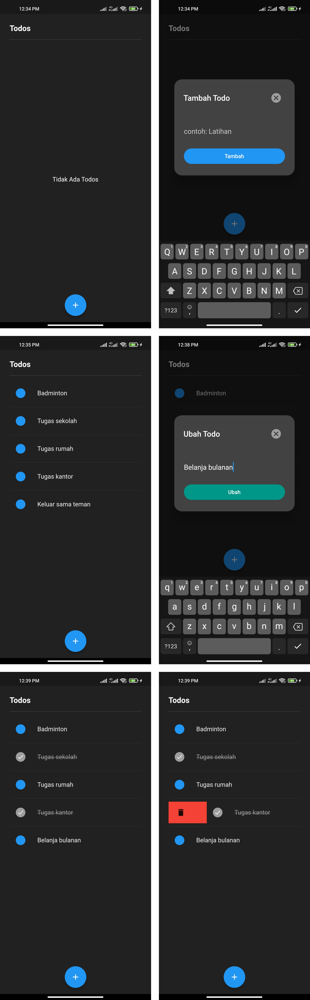

# To Do List App in Flutter

## Introduction
To Do List that can be used by users to record and manage tasks to be done. 

## Supported Devices
- Redmi Note 9 (Android)
- Realme 2 (Android)

## Supported Features
- Add new task => By tap the plus button in the bottom.
- Edit task => By long press the selected task.
- Delete task => By swipe task to left or right.
- Mark completed task => By single tap the selected task.

## Install an APK on a Device
From the command line:
1. Connect Android device to the computer with a USB cable.
2. Enter `cd pretest_md_pai`.
3. Run `flutter install`.

## Ready Apps
But, I have prepared the app that is ready to install on your android device. You can directly install the application in this Google Drive link:
> [https://drive.google.com/drive/folders/13OBn0urhaS6G9e-fDS_UDJVZE16Zkz23?usp=share_link](https://drive.google.com/drive/folders/13OBn0urhaS6G9e-fDS_UDJVZE16Zkz23?usp=share_link "Google Drive")

## Design

> By: Melanie Safira Vebriana